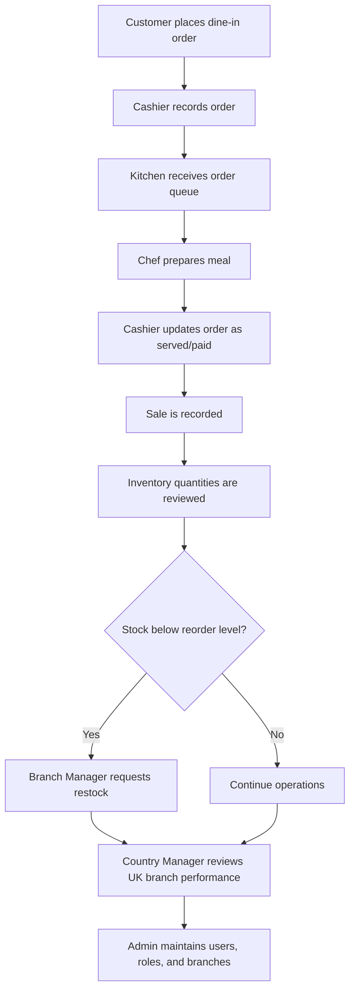
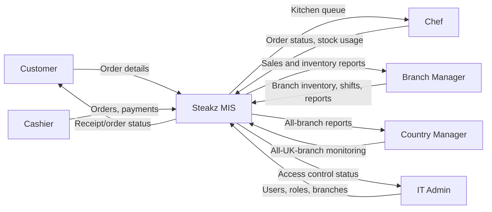

# Task 1 - Steakz Business Process, DFD, and MIS Forms

## 1. Business Process Model Diagram

## 2. Context Level / Level 0 DFD

## 3. Different Forms of MIS in Steakz

| MIS Form | Steakz Example | Main Users | Business Value |
|---|---|---|---|
| Transaction Processing System | Orders, sales, payments | Cashier, Branch Manager | Captures daily operations accurately |
| Inventory Management System | Stock quantity, reorder levels, suppliers | Chef, Branch Manager, Country Manager | Prevents stockouts and waste |
| Management Reporting System | Daily sales, branch revenue, low-stock lists | Branch Manager, Country Manager | Supports operational decisions |
| Decision Support System | Compare branch performance and reorder priorities | Country Manager | Helps planning and resource allocation |
| Human Resource MIS | Shift schedules and role assignments | Branch Manager, Admin | Controls staff availability and accountability |
| Security / Access Control MIS | Role-based access for branch and country users | Admin | Protects data and enforces responsibility |

## 4. Strategic, Tactical, and Operational MIS

| MIS Level | Steakz Example | Decision Supported |
|---|---|---|
| Strategic | Country Manager compares total revenue, low-stock patterns, and branch performance. | Whether to open new branches, change suppliers, or adjust UK strategy. |
| Tactical | Branch Manager reviews weekly sales, staff shifts, and inventory levels. | How to schedule staff, restock products, and improve branch operations. |
| Operational | Cashier creates orders, Chef updates order status, Customer places an order. | How daily restaurant work is completed accurately and quickly. |

## 5. Consequences of Not Having a Proper Information System

| Problem | Consequence for Steakz |
|---|---|
| Manual order tracking | Orders may be lost, duplicated, or delayed between cashier and kitchen. |
| No branch-level access control | Staff could see or change data from other branches. |
| No inventory alerts | Steakz may run out of steak, side dishes, or other key ingredients. |
| No sales reporting | Country Manager cannot compare branches or make reliable business decisions. |
| No user/role control | Former or incorrect employees may keep system access. |

## 6. Importance of Current, Valid, and Accurate Data

| Data Quality Need | Steakz Example | Management Benefit |
|---|---|---|
| Current data | Live order status, inventory quantities, and sales totals are updated as work happens. | Managers make decisions using the latest branch position instead of old manual notes. |
| Valid data | Forms validate emails, roles, branch IDs, order totals, and required stock fields. | Reduces wrong records and protects the reliability of reports. |
| Accurate data | Orders, sales, shifts, and inventory are stored in PostgreSQL through Prisma models. | Creates one trusted source of information for branch and headquarters decisions. |

If Steakz uses outdated or invalid data, the kitchen may prepare the wrong order, managers may restock too late, and headquarters may compare branches using incorrect figures. The MIS improves this by keeping data structured, role-controlled, and linked to the correct branch.

## 7. Management Reporting Use

| Report Type | Data Used | Decision Supported |
|---|---|---|
| Daily order report | Orders by branch and status | Kitchen workload, service delays, and customer demand. |
| Sales report | Sale amount, payment method, branch, cashier | Revenue tracking and branch performance review. |
| Inventory report | Quantity, unit, supplier, reorder level | Restocking decisions and waste reduction. |
| Shift report | Employee, role, branch, start/end time | Staff planning and accountability. |
| User and role report | User accounts, roles, assigned branch | Security review and access management. |

## 8. Ethical, Technical, and Regulatory Constraints

| Constraint Type | Possible Issue | Steakz Control |
|---|---|---|
| Ethical | Customer and employee information must not be exposed to unrelated staff. | JWT authentication, role permissions, and branch-level access control. |
| Ethical | Admins could misuse their ability to create or delete users. | Admin permissions are documented and can be extended with audit logs. |
| Technical | Database connection, server port, or migration setup may fail. | `.env`, Prisma migrations, seed data, and local PostgreSQL instructions are provided. |
| Technical | Branch users may accidentally access another branch if scope is not checked. | Branch Manager, Chef, and Cashier data is filtered by `branchId`. |
| Regulatory | Personal data must be handled carefully under privacy rules such as GDPR-style principles. | Passwords are hashed, API access requires tokens, and customer data is only available to permitted roles. |

## 9. Strategic Information Systems and Competitiveness

The Steakz MIS contributes to competitiveness by connecting restaurant operations to management decisions. Operational users complete daily tasks faster, tactical managers control stock and staffing, and headquarters can compare branch performance across the chain. This gives Steakz better service speed, fewer stock problems, clearer accountability, and stronger planning for future branches.
