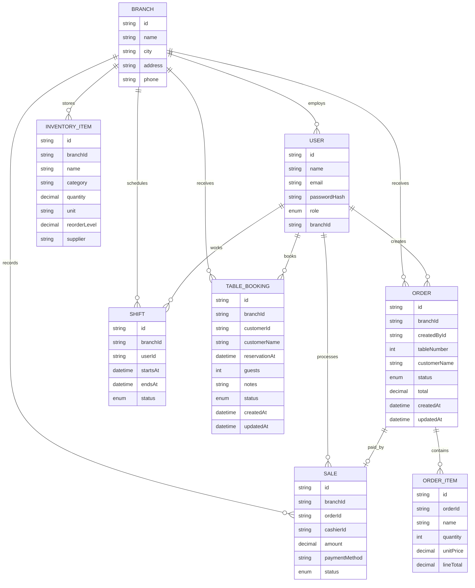

# Task 2 - BPP, ERD, Code Links, and Testing

## 1. Baseline Project Plan

| BPP Area | Plan for Steakz Application | Link to Business Process Model |
|---|---|---|
| Project Objective | Build a worldwide restaurant-chain MIS that manages branches, users, roles, inventory, orders, sales, shifts, and customer ordering. | Supports the full flow from customer order to inventory review and management reporting. |
| Scope | Web dashboard, customer portal, REST API, PostgreSQL schema, RBAC, Postman collection, documentation, and local deployment instructions. | Covers Customer, Waiter, Cashier, Chef, Branch Manager, Country Manager, and Admin activities. |
| Stakeholders | Country Manager, Branch Managers, Chefs, Waiters, Cashiers, Admin, and Customers. | Matches the actors in the context-level DFD. |
| Functional Requirements | Registration, login, branch management, user management, order tracking, sales recording, inventory control, shift scheduling. | Each requirement maps to a BPM activity. |
| Non-Functional Requirements | Secure authentication, role restrictions, branch-level data isolation, maintainable TypeScript code, responsive UI. | Ensures only allowed actors can perform BPM tasks. |
| Technology Stack | Backend: TypeScript, Express, REST API, Prisma, PostgreSQL, TSX, Nodemon. Frontend: React, TSX, Vite, CSS, Lucide icons. | Provides the system that automates the BPM. |
| Risks | PostgreSQL setup issues, role-scope mistakes, missing demo data, deployment configuration. | Risks could block order, inventory, or reporting processes. |
| Schedule | Week 1 analysis/docs, Week 2 database/API, Week 3 frontend, Week 4 testing/deployment and presentation. | Follows process priority: core operations first, reporting/security next. |
| Deliverables | Source code, PRD, SRS, ERD, DFD, BPM, endpoint list, Postman collection, testing notes, `.env` samples. | Matches all assignment deliverables. |
| Success Criteria | Users can log in by role, view allowed data, create/update core records, and present endpoints with test evidence. | Demonstrates complete process automation. |

## SOW Summary

| SOW Item | Description |
|---|---|
| Problem | Steakz needs one system to manage worldwide restaurant-chain operations instead of separate manual records for orders, stock, sales, staff, and branches. |
| Proposed System | A full-stack MIS with role-based login, customer registration, order processing, inventory tracking, sales records, shift scheduling, and admin controls. |
| Included Work | Backend API, frontend dashboard, customer portal, PostgreSQL database, Prisma schema, seed data, Postman collection, PRD/SRS, diagrams, and testing methodology. |
| Not Included | Real payment gateway, delivery tracking, live supplier purchasing, and production hosting setup. These are listed as future improvements. |
| Acceptance Criteria | The system runs locally, demo users can log in, customers can register, protected endpoints enforce permissions, and documentation matches the assignment checklist. |

## Review of Existing Information System and Recommended Improvements

| Existing Problem at Steakz | Improvement Implemented in the New MIS | Competitive Advantage |
|---|---|---|
| Orders may be handled manually between cashier and kitchen. | Digital order creation and role-based order status updates. | Faster service and fewer missed orders. |
| Branch stock may be tracked separately or manually. | Central inventory table with branch ownership and reorder levels. | Better stock control and reduced product waste. |
| Country management may not have a live view of all branches. | Country Manager can view all UK branch orders, inventory, sales, shifts, and branches. | Stronger strategic planning and branch comparison. |
| Staff may access information outside their branch. | Branch Manager, Chef, and Cashier are restricted by `branchId`. | Better security and clearer responsibility. |
| User roles may be difficult to control. | Admin can create users, modify roles, delete users, and create another admin. | Safer IT maintenance and easier staff onboarding. |
| Customers may have no self-service account flow. | Customer registration, login, order placement, and own-order view. | More convenient guest experience. |

## Three Levels of Access Evidence

| Access Level from Brief | Steakz Implementation | Evidence |
|---|---|---|
| Public/Open access | Home, Book a Table, Menu, Branches, Login/Register. | Frontend public tabs and `/api/auth/register`. |
| Branch/Operational access | Branch Manager, Chef, and Cashier see only own-branch operational data. | Backend `branchId` scoping and role dashboards. |
| Country/Admin access | Country Manager sees all branch information; Admin controls users, roles, and branches. | Protected endpoints and staff dashboards. |

## 2. ERD

## 3. Code, GitHub, and Deployment Links

| Item | Link / Location |
|---|---|
| Local backend code | `BackEnd/` |
| Local frontend code | `FrontEnd/` |
| GitHub link | Add your GitHub repository URL after pushing this folder. |
| Deployment link | Add your deployed frontend/API URLs after deployment. |

## 4. Short Testing Methodology

| Test Type | What to Test | Expected Result |
|---|---|---|
| Authentication Testing | Login with staff demo users and register a new customer. | Valid users receive JWT and role details. |
| Authorization Testing | Chef tries to access another branch's orders. | Request is rejected with `403 Forbidden`. |
| Customer Permission Testing | Customer tries to access inventory, sales, or shifts. | Request is rejected with `403 Forbidden`. |
| API Testing | Use Postman collection for GET/POST/PUT/DELETE routes. | Correct status codes and JSON responses. |
| Database Testing | Run Prisma migration and seed. | Tables and demo records are created. |
| UI Testing | Open dashboard as each role. | User sees correct branch and operational data. |
| Regression Testing | Re-test inventory, order, sale, and shift flows after changes. | Existing flows still work. |

## Additional System Features

| Feature | Reason |
|---|---|
| Supplier purchase orders | Converts low-stock alerts into restock requests. |
| Customer loyalty accounts | Tracks repeat customers and rewards. |
| Delivery module | Adds Delivery Guy role and order dispatch tracking. |
| Analytics charts | Improves country-level branch comparison and forecasting. |
| Audit logs | Records Admin and Manager changes for accountability. |

## Critical Review of Developed Web Portal

| Review Area | Strength | Limitation / Future Improvement |
|---|---|---|
| Functionality | Covers core MIS processes: users, roles, branches, bookings, saved order items, sales, shifts, and customer ordering. | Add payment gateway processing in a production version. |
| Security | JWT login, password hashing, role permissions, and branch-level data isolation are implemented. | Add audit logs, password reset, and stricter production secrets before deployment. |
| Usability | Public website and role dashboards make the system easy to demonstrate. | Add charts and filters for larger datasets. |
| Data management | Prisma schema and PostgreSQL provide structured, related records. | Add backups and advanced reporting for real restaurant operations. |
| Assessment fit | Demonstrates a new web portal for MIS with public, branch, and headquarters/admin access levels. | Deployment and GitHub URLs still need to be inserted after publishing. |
